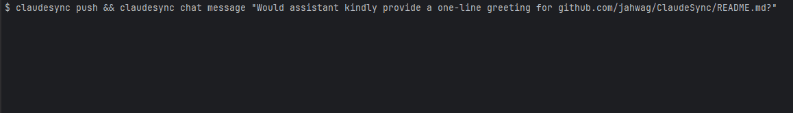

<<<<<<< HEAD
# InternalAPI
=======
# ClaudeSync

[](https://opensource.org/licenses/MIT)
[](https://pypi.org/project/claudesync/)
[](https://github.com/jahwag/claudesync/releases)
[](https://github.com/jahwag/ClaudeSync/actions/workflows/python-package.yml)
[](https://github.com/jahwag/claudesync/issues)
[](https://github.com/psf/black)
[](https://github.com/jahwag/claudesync/network/dependencies)
[](https://github.com/jahwag/claudesync/commits/main)
[](https://github.com/sponsors/jahwag)


ClaudeSync bridges your local development environment with Claude.ai projects, enabling seamless synchronization to enhance your AI-powered workflow.



## ⚠️ Disclaimer

ClaudeSync is an independent, open-source project **not affiliated** with Anthropic or Claude.ai. By using ClaudeSync, you agree to:

1. Use it at your own risk.
2. Acknowledge potential violation of Anthropic's Terms of Service.
3. Assume responsibility for any consequences.
4. Understand that Anthropic does not support this tool.

Please review [Anthropic's Terms of Service](https://www.anthropic.com/legal/consumer-terms) before using ClaudeSync.

## 🌟 Features

- **File sync**: Synchronize local files with [Claude.ai projects](https://www.anthropic.com/news/projects).
- **Cross-Platform**: Compatible with [Windows, macOS, and Linux](https://github.com/jahwag/ClaudeSync/releases).
- **Configurable**: Plenty of [configuration options](https://github.com/jahwag/ClaudeSync/wiki/Quick-reference).
- **Integrate**: Designed to be easy to integrate into your pipelines.
- **Secure**: Ensures data privacy and security.

## ⚙️ Prerequisites

### 📄 Supported Claude.ai plans

| [Plan](https://www.anthropic.com/pricing)   | Supported |
|--------|-----------|
| Pro    | ✅        |
| Team   | ✅        |
| Free   | ❌        |

### 🔑 SSH Key

Ensure you have an SSH key for secure credential storage. Follow [GitHub's guide](https://docs.github.com/en/authentication/connecting-to-github-with-ssh) to generate and add your SSH key.

### 💻 Software

- **Python**: ≥ [3.10](https://www.python.org/downloads/)
- **pip**: [Python package installer](https://pip.pypa.io/en/stable/installation/)

## 🚀 Quick Start

1. **Install ClaudeSync**
    ```shell
    pip install claudesync
    ```

2. **Authenticate**
    ```shell
    claudesync auth login
    ```

3. **Create a Project**
    ```shell
    claudesync project create
    ```

4. **Start Syncing***
    ```shell
    claudesync push
    ```
    **This is a one-way sync. Files not present locally will be removed from the Claude.ai project unless pruning is [disabled](https://github.com/jahwag/ClaudeSync/wiki/Quick-reference#pruning-remote).*

📚 [Detailed Guides & FAQs](https://github.com/jahwag/claudesync/wiki)

## 🤝 Support & Contribute

Enjoying ClaudeSync? Support us by:

- ⭐ [Starring the Repository](https://github.com/jahwag/claudesync)
- 🐛 [Reporting Issues](https://github.com/jahwag/claudesync/issues)
- 🌍 [Contributing](CONTRIBUTING.md)
- 💬 [Join Our Discord](https://discord.gg/pR4qeMH4u4)
- 💖 [Sponsor Us](https://github.com/sponsors/jahwag)

Your contributions help improve ClaudeSync!

---

[Contributors](https://github.com/jahwag/claudesync/graphs/contributors) • [License](https://github.com/jahwag/claudesync/blob/master/LICENSE) • [Report Bug](https://github.com/jahwag/claudesync/issues) • [Request Feature](https://github.com/jahwag/claudesync/issues/new?labels=enhancement&template=feature_request.md)• [Sponsor](https://github.com/sponsors/jahwag)
>>>>>>> 8045467 (Added web dev support fixed api)
